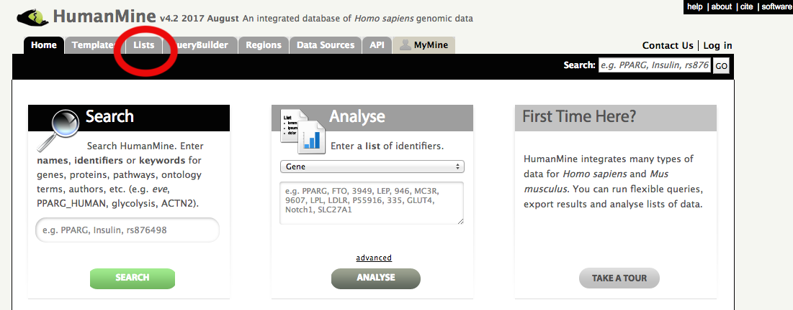
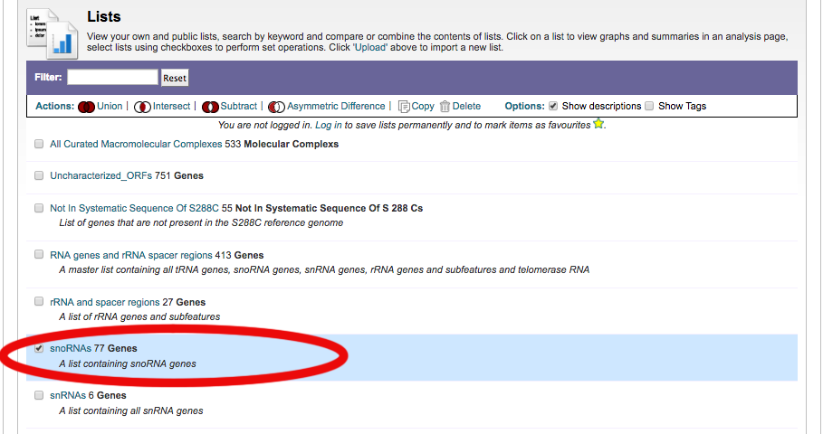
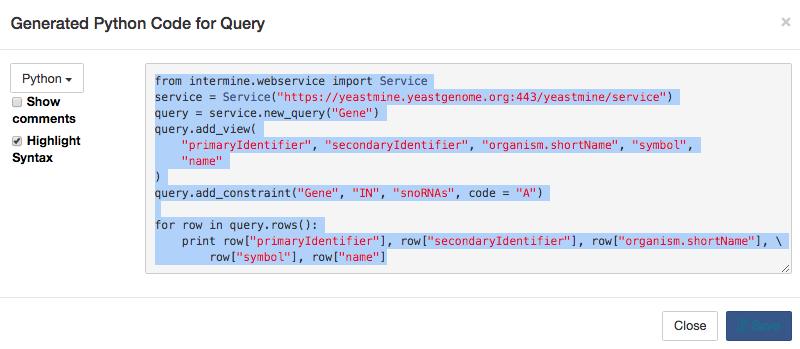

# Leveling up your Intermine Skills with Jupyter Notebooks backed by Binder

Guide to getting started with using Intermine sites and Jupyter using MyBinder.org-served Jupyter notebooks.

--------------------

Intermine and the Intermine-powered sites offer a powerful web service that allows automating making queries and making lists with code. Maybe you'd like to take advantage of this to start integrating computational solutions into your research tasks, but aren't fond of setting up your computer and maintaining all the working pieces. Maybe you've heard of the Jupyter computational system and were wondering what are some of the ways you could take advantage of it to do biological research? Or maybe you already interface with Intermine computationally and are looking to increase reproducibility value of your code and/or take advantage of code and data sharing options.
Here, I'll introduce the powerful combination of using Intermine's resources in conjunction with active Jupyter notebooks served via the Binder service. Now, at the very least, you can run any of the Python code generated by the Intermine-associated sites with just a browser. 

Binder: eliminating hurdles
---------------------------

Biological researchers looking to utilize computational tools in their research face numerous hurdles. The Binder system offered at MyBinder.org provides a computational environment within Jupyter notebooks that aims to eliminate many of these hurdles, enabling researchers to focus on effecitve use of the tools and sharing of the data. Among the barriers the Binder system addresses is the issue of "I'd like to try that, but where do I begin setting up my computer...and [then I have to maintain it](https://twitter.com/jakevdp/status/990974323794956293)" issue, visits to "dependency hell", the need to adjust your system's ['PATH' and divine where Jupyter looks for things](https://twitter.com/jakevdp/status/994548776814686208), and the head-scratch inducing problem of "well, it runs on my computer...". Furthemore, it mitigates fragmentation by aiding users in keeping data and steps documented and associated.  Here, I will focus on a few ways researchers can leverage Intermine's resources via the Jupyter notebook and Binder system to perform both basic and advanced tasks on the Intermine sites, such as HumanMine, FlyMine, and YeastMine.

I will stick to using Python for these examples. However, the Binder system is already able to handle many of the open source languages that Jupyter notebooks support. Intermine is able to produce code for several languages as well.

Intermine and Binder: a very basic example
------------------------------------------

In addition to the web-based interfaces that you access in your browser at the Intermine-powered sites, such as HumanMine, FlyMine, and YeastMine, Intermine also offers an API, or application programming interface. That is just a fancy way to say that Intermine makes it possible for programming languages to easily query Intermine and get results via the internet. It is this interface that can be used in the Jupyter notebooks served from Binder where installations and dependencies are already handled and users can get right to performing computational tasks.

A simple example will hopefully demonstrate how easy this is via the Binder service.

- Step 1. Go to your favorite Intermine-powered site. Near the top of that site will be a navgation bar with tabs, and you want to select the 'Lists' tab, which is most likely found between 'Templates' and 'QueryBuilder' tabs.

- Step 2. Now depending on the Intermine-powered site you are on, you may be taken directly to a 'Lists' page with a list, or you'll be presented with a form to make a custom list by uploading a list of identifiers. Because we are looking for the former in this example, if you see an interface to `Upload` a list, click `View` below the navigation bar where you had clicked 'Lists' before to toggle the 'View' page of 'Lists'. On the 'Lists' page that comes up, select any one of them from the list you see.  
For my example, I am selecting the snoRNA lists from YeastMine's 'Lists' section.

- Step 3. In the next window, you'll see a list that is probably familiar to you if you have used the Intermine-powered sites before. But we want to get the code to generate this list. Just above your list, towards the right side, you'll see a button that says 'Generate Python code', and you need to click that.

- Step 4. Highlight and copy into your clipboard the code in the box that comes up. (Or, alternatively use `Save` button and get code for pasting in cell off your computer later)

- Step 5. Run the Binder set up for using Intermine by going to [here](https://github.com/fomightez/intermine-binder) and pressing the `launch binder` button on that page.

- Step 6. Wait while the Binder service spins up a Jupyter environment just for you. This could take a minute or two (most likely much less than that), and so you need to be patient.
When you see a notebook page with the Jupyter logo in the upper left corner, you are ready to paste your code into the page. I left some code in the box, just select that and paste in yours instead. Alternatively, hit the plus symbol that will be to the left of the scissors icon on the toolbar just above the notebook in order to make a new cell where you can then paste your code.

  Now you are ready to run your code.  

- Step 7. Hit the `Run` button that is to the left of the middle of the toolbar just above the notebook page to run that cell. Alternatively, press `shift-enter` to execute the code in the cell. If that works and runs the code you'll see output.

  If you are trying this early in 2018, chances are good though that it didn't work as expected, and it instead reported an error about `Missing parentheses in call to 'print'`. This is because Python is currently past a major crossroads, and the Intermine folks haven't updated their code to the latest version of Python. However, it is easy to fix this so that it works in the Python 3 universe. This Binder environment is running Python 3 and it has many terrific features, and so it is best to be moving in the direction of using it. Luckily, a simple conversion can be automatically performed at a push of a button to fix the code you pasted.  Note that if it works immediately as pasted in without the conversion, then Intermine has updated their code generating system and this conversion won't be needed. My plan is to update the associated Jupyter notebooks to make this clear when this happens.

  To perform the correction, click in the cell where you pasted the code to select that cell, and then click the button up on the right side on the toolbar that says 'Convert current cell from Python 2 to 3'. Now try again to run the code in the cell with shift-enter, and it should work.

  You just ran code on Intermine via your browser with no set-up of a computer needed. Congratulations! 

  This was just meant to touch upon what can be done with Intermine and Binder, both of which are separately powerful in their own right.

  Note, a similar process can be performed with any of the 'Templates' that come up when you navigate to 'Templates' from the home page. I chose 'Lists' for illustrating in the example above because the 'Templates' usually require some minimal input from you to get to the point where you'll have an actual list of items; however, we will discuss using these 'Templates' below as they are the best way to get close to what you want the fastest or assemble the parts to develop the exact code needed to get what you are after.

  Hopefully, that gives you a taste for what you can do without needing to worry about setting up and maintaining any system. This makes repetitive tasks much easier, but allows even more complex queries and workflows to be developed, documented, and shared.

  At this point, this may be enough to get you started and may have given you a feel for what you need to work on to fully be able to take advantage of using Intermine's API. Perhaps via Binder you see that this may be easier than you previously imagined. For those of you wishing to see and learn more about both Binder and Intermine, I am going to discuss more about setting up to use Intermine via Binder and illustrate using that to perform an advanced workflow that takes advantage of the Intermine API.

------
